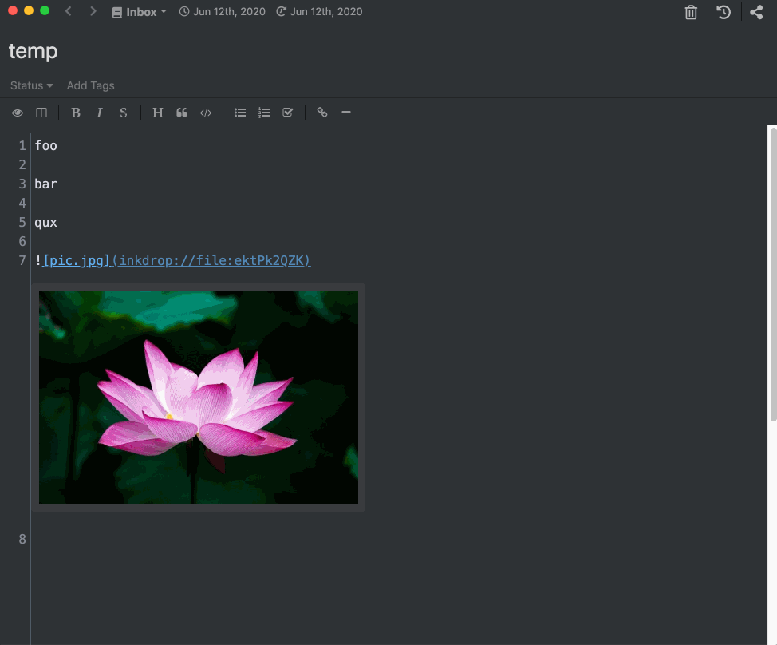

# inkdrop-hovering-expansion-image
This is a Inkdrop plugin.
- A image will be expanded when the image is hovered.
- Default image size is small.

A plugin is [here](https://my.inkdrop.app/plugins/hovering-expansion-image).

Installation command: `ipm install hovering-expansion-image`

